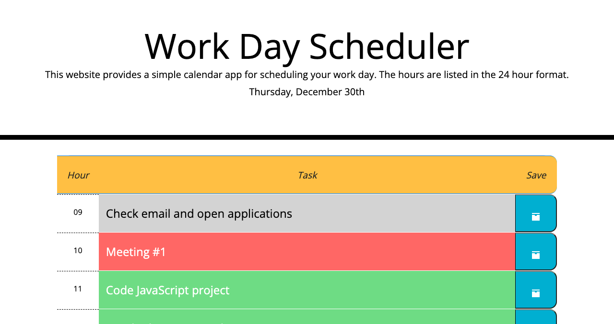

# workday-scheduler

## In this project I...
### 1) Elaborated upon existing HTML and CSS properties (including bootstrap properties) to create a simple calendar for typical workday hours
### 2) Wrote my own custom JavaScript which, along with JQuery and moment.js, allows users to...
* see the current date when they are using the application.
* input text to represent tasks for each hour of a typical workday.
* save user inputs to localstorage and then print those values to the page.
* click on a timeblock to edit the task therein.
* see whether a task is in the past, present, or future relative to the user's current time.

[Link to Deployed Application](https://sora64.github.io/workday-scheduler/)

